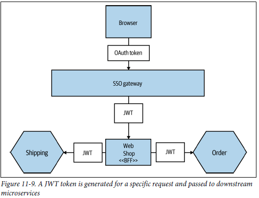

# EASV-SI-Compulsary-Assignment-2

## Week 45 - Reliable Microservices

The following mitigations have been implemented: 

**Healthchecks** for monitoring the health of each microservice.
By adding condition:service_healthy in the depends_on section of a microservice in docker-compose.yml, 
it is guaranteed that the "depender" microservice does not start before the "dependee" microservice is healthy.  

**ocelot.json Rate Limits and Circuit Breakers** for limiting requests per user and protecting against abuse.
In *ocelot.json*, QoSOptions are used for configuring circuit breakers and retries. 
```
    {
        "RateLimitOptions": {
            "ClientWhitelist": [],
            "EnableRateLimiting": true,
            "Period": "1m",
            "PeriodTimespan": 60,
            "Limit": 100
        },
        "QoSOptions": {
            "ExceptionsAllowedBeforeBreaking": 3,
            "DurationOfBreak": 10000,
            "TimeoutValue": 5000
        }
    }
```

**ApiGateway Retry Logic, Circuit Breaker and Fallback Logic**
In *Program.cs* �n ApiGateway, Polly is being added to handle transient failures with retry, circuit breaker, and fallback policies. 
And Ocelot is being configured to use the HttpClient "OcelotHttpClient" that has been configured with Polly policies.  
```
    builder.Services.AddHttpClient("OcelotHttpClient")
        .AddTransientHttpErrorPolicy(policyBuilder => 
            policyBuilder.WaitAndRetryAsync(3, retryAttempt => TimeSpan.FromMilliseconds(500)))
        .AddTransientHttpErrorPolicy(policyBuilder =>
            policyBuilder.CircuitBreakerAsync(5, TimeSpan.FromSeconds(30)))
        .AddPolicyHandler(Policy<HttpResponseMessage>.Handle<HttpRequestException>()
            .FallbackAsync(async cancellationToken =>
            {
                return new HttpResponseMessage(HttpStatusCode.OK)
                {
                    Content = new StringContent("{\"message\": \"Service temporarily unavailable\"}",
                        Encoding.UTF8, "application/json")
                };
            }));

    builder.Services.AddOcelot(builder.Configuration).AddPolly();
```

**TimelineServiceHttpClient for Retry Logic and Circuit Breaker**
The HttpClient in TimelineService that sends requests to UserManagementService and to PostManagementService in order to create the user feed
is configured with Polly policies as well.
```
    builder.Services.AddHttpClient("TimelineServiceClient")
        .AddTransientHttpErrorPolicy(policyBuilder => policyBuilder.WaitAndRetryAsync(3, retryAttempt => TimeSpan.FromMilliseconds(500)))
        .AddTransientHttpErrorPolicy(policyBuilder => policyBuilder.CircuitBreakerAsync(5, TimeSpan.FromSeconds(30)));
```

## Week 46 - Kubernetes

**Steps I have done to setup Kubernetes for the Twitter System:**

- CI/CD pipeline in Github Actions that builds the projects and pushes them to Docker Hub
- k8s.yml-files for each microservice including ApiGateway
- ApiGateway service is exposed on port 80 and port-forwarded to localhost:5000 using ```kubectl port-forward service/api-gateway 5000:80``` 
  so requests from Postman can be sent to the same url as before setting up Kubernetes. 

**Setup: Kubernetes Dashboard**

First apply the following YAML file to create the Kubernetes Dashboard:

```kubectl apply -f https://raw.githubusercontent.com/kubernetes/dashboard/v2.7.0/aio/deploy/recommended.yaml```

Create service account and grant privileges:

```kubectl create sa webadmin -n kubernetes-dashboard``` 

```kubectl create clusterrolebinding webadmin --clusterrole=cluster-admin --serviceaccount=kubernetes-dashboard:webadmin```

Get the token for the service account:

```kubectl create token webadmin -n kubernetes-dashboard```

Run the following command:

```kubectl proxy```

Open the following URL in your browser:

http://localhost:8001/api/v1/namespaces/kubernetes-dashboard/services/https:kubernetes-dashboard:/proxy/

Use the token to login.


## Week 47 - Security
To cover the "Security" topic of the compulsary assignment, i have implemented north-south security by making "twitter-network" internal. 
Furthermore I have implemented east-west security to handle the security risk of microservice-to-microservice communication. 

Previously a request was sent to ApiGateway with the jwt generated in AuthenticationService. 
The ApiGateway would validate the token and route the request to the proper microservice where it would be handled. 

**My implementeation of east-west security is currently not working** but the idea is: 
- A request is sent to ApiGateway with the jwt from AuthenticationService as previously. 
- The token is still validated in ApiGateway as previously.
- In the receiving microservice a new jwt should be generated with authority to read/write to the endpoints in that microservice. 
- This token should be added to the request when received by ApiGateway. This should be implemented by creating an 
  HTTP client and configuring it with an authorization header and then adding the token as bearer token.
- In the receiving microservice the token from the http header is validated and the request is handled. 


**Source:**  
S.Newman, *Building Microservices: Designing Fine-Grained Systems*, 2nd ed. Sebastopol, CA, USA: O'Reilly Media, 2021.

I have only tried to implement east-west security for "UserManagementService" and as it is not working, 
I will not try to implement it any further as it will break the functionality of the microservices. 

## Week 48 - Design Patterns

I have decided to implement a sidecar pattern using Fluent Bit which is a fast, lightweight, and highly scalable logging, metrics, and traces processor and forwarder. 
Logs from multiple microservices are collected and written to separate log files within a shared directory for a easy monitoring. The logs are parsed a JSON for a structured and easy analysis. 

Implementing a sidecar is a way to achieve separation of concerns as the sidecar handles non-core functionality and allows the microservice(s) to focus on core logic. 
A sidecar can be reused by different microservices as is the case in my twitter-clone system.  